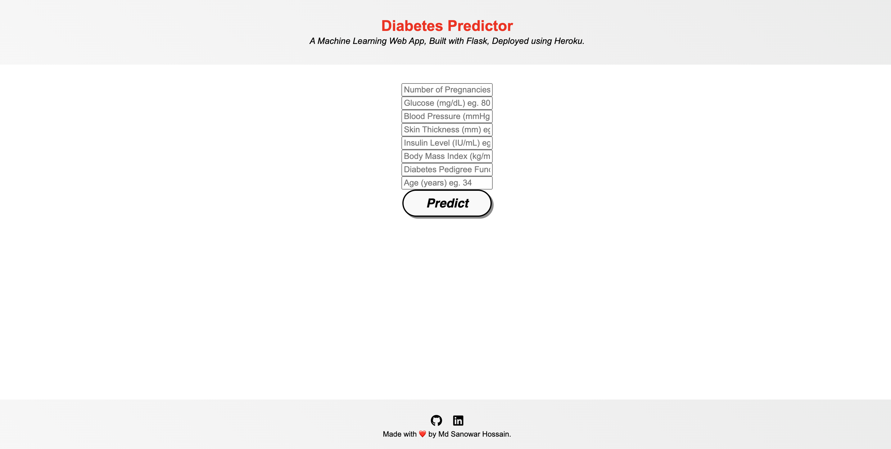

# Developed-Diabetes-Testing-Model
Developed a Diabetes testing model utilizing Machine Learning Algorithms, the Flask API for Web Applications, and the Heroku cloud infrastructure.

# Diabetes Prediction - Deployment
  

[Dataset Link:](https://www.kaggle.com/datasets/mathchi/diabetes-data-set)

• This repository consists of files required to deploy a ___Machine Learning Web App___ created with ___Flask___ on ___Heroku___ platform.

### web app:




1. activate vertual environment
```
source virtualenv/bin/activate
```
2. install requirements.txt file
```
3. run app.py for web application
```
python app.py
```


• Please do ⭐ the repository, if it helped you in anyway.
